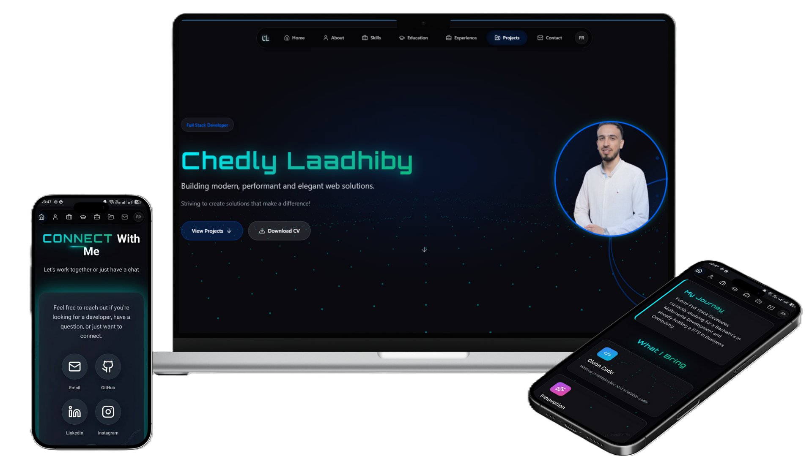

# Portfolio - Chedly Laadhiby

Bienvenue sur mon portfolio professionnel. Je suis Chedly Laadhiby, développeur Full Stack passionné par la création de solutions web modernes, performantes et élégantes.

## À propos

Ce portfolio présente mon parcours professionnel, mes compétences, mes projets et mon expérience dans le développement web. Il a été conçu pour offrir une expérience utilisateur fluide et immersive, disponible en français et en anglais.

## Sections

- **Accueil** - Présentation et introduction
- **À propos** - Mon parcours et ma vision
- **Compétences** - Technologies et outils que je maîtrise
- **Formation** - Mon parcours éducatif
- **Expérience** - Mes expériences professionnelles
- **Projets** - Réalisations et travaux
- **Contact** - Me contacter et réseaux sociaux

## Caractéristiques

- Design moderne et futuriste avec animations fluides
- Interface entièrement responsive pour tous les appareils
- Support multilingue (Français/Anglais)
- Thème sombre avec effets de glassmorphism
- Performance optimisée

## Contact

Pour toute question ou collaboration, vous pouvez me contacter via les liens disponibles dans la section Contact du portfolio.

GitHub: [ShedlyLaad](https://github.com/ShedlyLaad)

---

© 2024 Chedly Laadhiby - Tous droits réservés